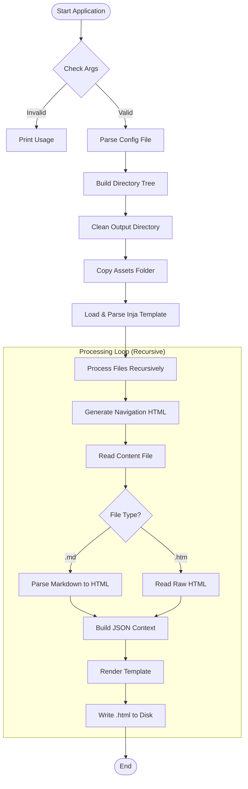

# GHP Static Site Generator - Architecture & Design

comprehensive architecture documentation for the GHP Static Site Generator (v1.x.x). It includes high-level concepts, data flow, internal components, and diagrams using Mermaid syntax (standard for GitHub Markdown).

---

<!-- START doctoc generated TOC please keep comment here to allow auto update -->
<!-- DON'T EDIT THIS SECTION, INSTEAD RE-RUN doctoc TO UPDATE -->

**Table of Contents**

- [How To Use GH Docs Bot Action](#how-to-use-gh-docs-bot-action)
  - [Inputs](#inputs)
  - [Example Workflow](#example-workflow)
  - [Prerequisites](#prerequisites)

<!-- END doctoc generated TOC please keep comment here to allow auto update -->

---

## Architecture Overview

- Version: 1.x.x
- Language: C++23
- License: MIT
- command line tool
- Platform: Linux, macOS

## System Overview

The GHP Static Site Generator is a high-performance console application designed to convert a recursive directory structure of content files into a fully navigational static HTML website. It supports Markdown (.md) for content authoring and raw HTML fragments (.htm) for custom layouts, wrapping them into a customizable Inja template.

### Key Features

- **Recursive Scanning**: Maps arbitrary folder depths.
- **Hybrid Parsing**:
  - \*.md files are parsed to HTML via md4c.
  - \*.htm files are injected as raw content fragments.
- **Automated Navigation**: Generates a recursive Side-Nav HTML structure based on the file system.
- **Root Isolation**: Files in the root directory are generated but excluded from the navigation tree to keep the menu clean.
- **Asset Management**: Automatically copies theme assets (CSS, JS, Images) from a configured source.
- **Templating**: Uses Inja for variable substitution (Title, Navigation, Content, Base Path).

## High-Level Architecture

The system operates on a linear Pipeline Pattern. It takes three primary inputs (Configuration, Content, Template) and produces a directory of static HTML files.

```mermaid
graph LR
    subgraph Inputs
        A[Config File *.cfg]
        B[Content Folder]
        C[Template HTML]
        D[Assets Folder]
    end

    subgraph Core Engine "GHP Generator (C++)"
        E[Config Parser]
        F[Tree Builder]
        G[Asset Manager]
        H[Template Engine]
        I[Content Processor]
    end

    subgraph Output
        J[Static Website /dist]
    end

    A --> E
    B --> F
    D --> G
    C --> H
    F --> I
    H --> I
    I --> J
```

## Core Workflow

The main() function orchestrates the lifecycle of the generation process.

Execution Flow Diagram



## Component Design

The application is structured around data-driven components.

### Data Structures

**DirNode (The File Tree)**

Represents the recursive file system structure in memory.

```C++
struct DirNode {
  fs::path relativePath;        // Path relative to input root
  std::string dirName;          // Name of the current folder
  std::vector<fs::path> files;  // .md and .htm files in this folder
  std::vector<DirNode> subdirs; // Nested directories
};
```

**Config**

Holds runtime settings loaded from the .cfg file.

```C++
struct Config {
  fs::path templatePath; // Path to template.html
  fs::path outputDir;    // Destination folder
  fs::path assetsPath;   // Source assets folder (images/css)
};
```

### Key Logic Units

#### Tree Builder (buildTree)

**Role:** Scans the input directory.

**Filters:**

- Ignores files/folders starting with . (hidden files).
- Ignores the folder named assets (to prevent recursion loops if source and output overlap, and to keep navigation clean).
- Only accepts .md and .htm files.

**Sorting:** Sorts directories and files alphabetically for consistent navigation order.

#### Navigation Generator (generateNavHtml)

**Role:** Creates the HTML <ul><li> structure for the sidebar.

**Logic:**

- Receives the full rootNode to generate the complete menu for every page.
- **Root Exclusion:** Accepts an isRoot flag. If true, files in the top-level directory (like index.md) are not added to the navigation list, but subdirectories are. This prevents the "Home" page or loose root files from cluttering the menu.
- **Active State:** Compares the current file path with the link target to add class="active" for CSS highlighting.
- **Hierarchy:** Renders folders as <strong>DirectoryName</strong> and nests files inside.

#### Content Processor

- **Markdown:** Uses md4c-html to convert Markdown text into safe HTML.
- **HTML Fragments:** .htm files are read as plain text and injected directly. This allows specific pages to use complex HTML layouts (grids, cards) that Markdown cannot express.

#### Template Injection (Inja)

Merges the processed data into the HTML skeleton.

**JSON Context Data:**

- base_path: Relative path back to root (e.g., ../../) for linking CSS/JS correctly from subfolders.
- title: Filename without extension.
- navigation: The generated sidebar HTML string.
- content: The converted page body.

## File System Structure

### Input Structure (Example)

```bash
docs/
├── architecture
│   └── overview.md
├── howtos
│   ├── github_action.md
│   └── static_website.md
├── index.md
└── screenshots
    └── themes.htm
```

### Design Structure (Example)

```bash
theme/blue/
├── assets
│   ├── css
│   │   └── main.css
│   ├── favicon.ico
│   ├── favicon.svg
│   ├── img
│   │   ├── blue_dark.png
│   │   ├── blue_light.png
│   │   ├── favicon.svg
│   │   ├── matrix.png
│   │   ├── themes.png
│   │   └── tron.png
│   └── js
│       └── main.js
├── assets copy
└── blue.cfg
```

### Output Structure (Example)

```bash
/dist/
├── architecture
│   └── overview.html
├── howtos
│   ├── github_action.html
│   └── static_website.html
├── index.html
└── screenshots
    └── themes.html
```

## Dependencies & Libraries

| Library         | Purpose        | Rationale                                      |
| :-------------- | :------------- | :--------------------------------------------- |
| std::filesystem | File I/O       | C++ Standard (modern, cross-platform).         |
| nlohmann/json   | Data Structure | Standard for passing data to template engines. |
| pantor/inja     | Templating     | Fast, Python/Jinja2-like syntax for C++        |
| md4c            | Markdown       | Extremely fast, compliant C markdown parser    |

## Configuration Reference

```ini
# Path to the HTML layout file
template=/path/to/theme/template.html

# Folder containing CSS/Images to be copied
assets=/path/to/theme/assets

# Target directory for the website
output=/path/to/dist
```

## Build & Deployment

### Compilation

Requires a C++23 compliant compiler (GCC/Clang) and the linked libraries.

_Linux Example:_

```bash
g++ -std=c++23 -o ssg main.cpp -lmd4c-html -lmd4c
```

> ![TIP]
> see `CMakeLists.txt` for more details

### Execution

`Usage: build/gh_docs_bot <path_to_config> <input_folder>`

**_Example_**

`./gh_docs_bot /home/zb_bamboo/DEV/gh-a_cr-ghp/theme/blue/blue.cfg /home/zb_bamboo/DEV/gh-a_cr-ghp/docs`

#### Inputs

| Input            | Description                                      |
| :--------------- | :----------------------------------------------- |
| `path_to_config` | Path to the config file to use for the site.     |
| `path_to_docs`   | Path to the input directory to use for the site. |
