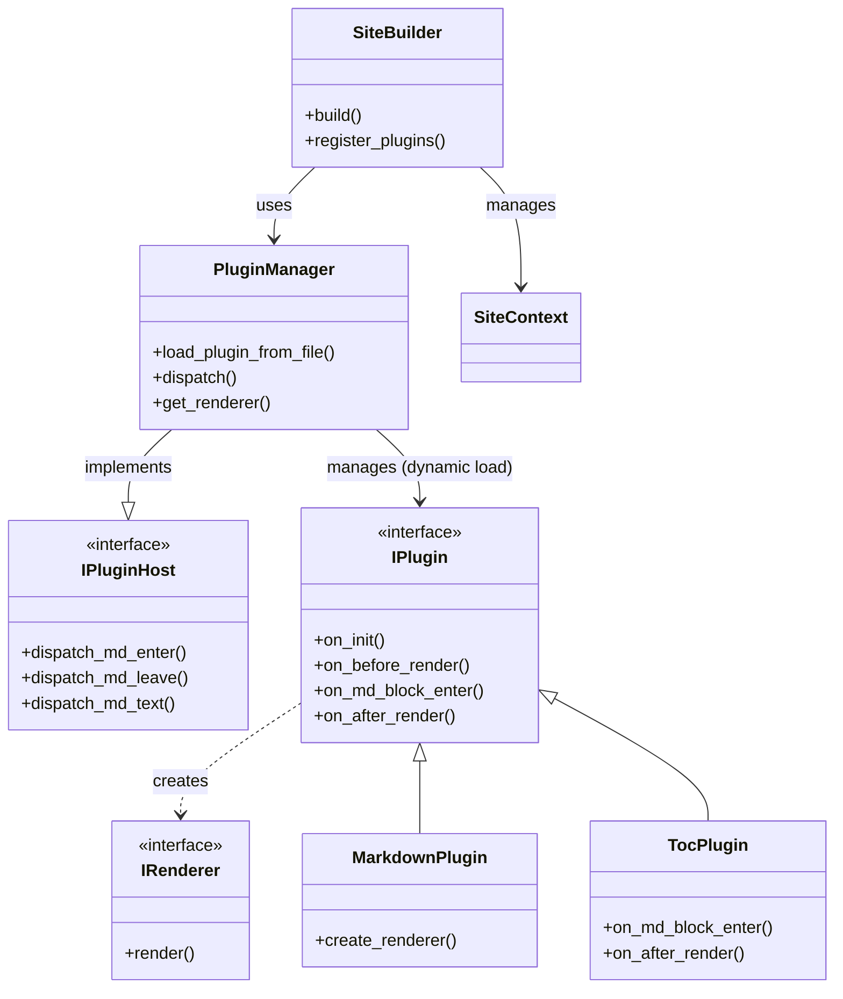
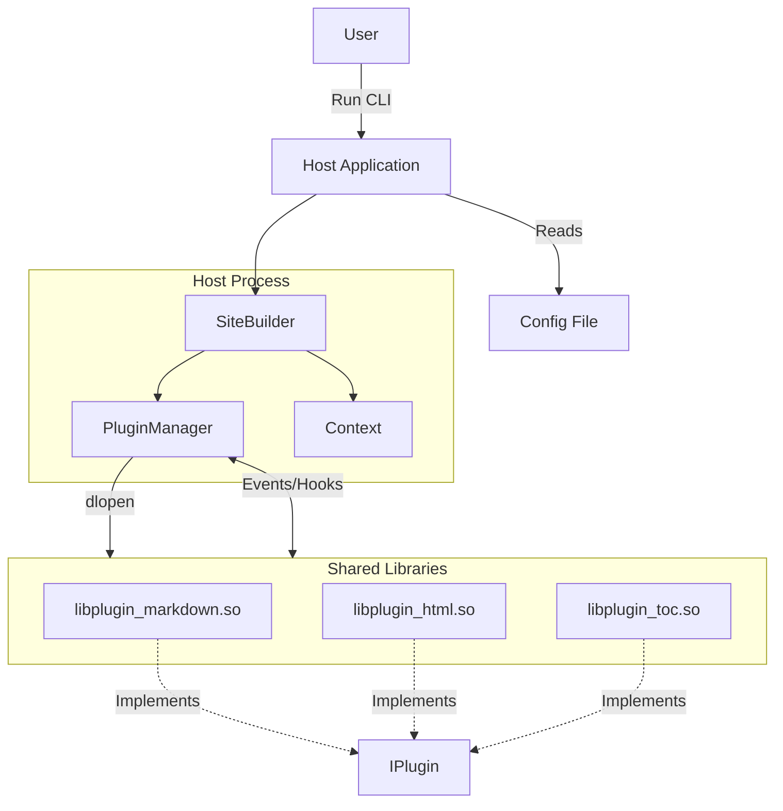
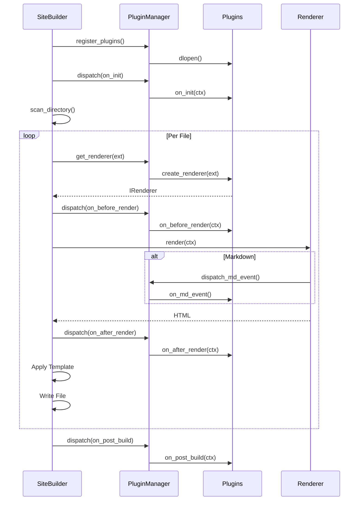

# Architecture & Refactoring Overview

<!-- START doctoc generated TOC please keep comment here to allow auto update -->
<!-- DON'T EDIT THIS SECTION, INSTEAD RE-RUN doctoc TO UPDATE -->
**Table of Contents**

- [1. Motivation](#1-motivation)
- [2. New Architecture: Dynamic Plugin System](#2-new-architecture-dynamic-plugin-system)
  - [2.1 Core Components](#21-core-components)
  - [2.2 Diagrams](#22-diagrams)
    - [Class Diagram](#class-diagram)
    - [High-Level Architecture](#high-level-architecture)
    - [Build Workflow](#build-workflow)
- [3. The "No-Regex" Approach](#3-the-no-regex-approach)
- [4. Directory Structure](#4-directory-structure)

<!-- END doctoc generated TOC please keep comment here to allow auto update -->

## 1. Motivation

The original Static Site Generator (SSG) was a monolithic C++ application. While functional, it had several limitations:

- **Scalability:** Adding new features (like syntax highlighting or RSS feeds) required modifying the core logic and recompiling the entire application.
- **Fragility:** Table of Contents (TOC) generation relied on Regex parsing of HTML, which is error-prone.
- **Flexibility:** Markdown rendering was tightly coupled to the build process.

## 2. New Architecture: Dynamic Plugin System

The redesigned architecture separates the **Host Application** (`gh_docs_bot`) from the **Logic** (`Plugins`). Plugins are now compiled as **Shared Libraries** (`.so` files) and loaded dynamically at runtime.

### 2.1 Core Components

- **SiteBuilder:** The main controller. It scans directories, manages the lifecycle of the build process, and orchestrates the `PluginManager`. It reads the configuration to determine which plugins to load.
- **PluginManager:** Responsible for loading plugins dynamically using `dlopen`/`dlsym` and dispatching events (Hooks). It acts as the `IPluginHost` for plugins.
- **IPluginHost:** An interface exposed to plugins allowing them to interact with the host (e.g., dispatching markdown events back to the manager) without linking against the manager implementation.
- **Plugins:** Standalone shared libraries (e.g., `libplugin_markdown.so`) that implement the `IPlugin` interface and export factory functions (`create_plugin`, `destroy_plugin`).
- **Context Models:**
  - `SiteContext`: Holds global configuration, paths, and shared data.
  - `PageContext`: Holds data specific to the current file being processed (raw content, HTML, metadata, headers).

### 2.2 Diagrams

#### Class Diagram



#### High-Level Architecture



#### Build Workflow



## 3. The "No-Regex" Approach

A key requirement was removing Regex for HTML parsing. We achieved this by hooking directly into the Markdown parser (MD4C) events.

1.  **Parsing:** The `MarkdownPlugin` initiates the MD4C parser.
2.  **Interception:** The `TocPlugin` subscribes to `on_md_block_enter`.
3.  **Extraction:** When a Header (`H1`-`H4`) is detected, the `TocPlugin` captures the text stream directly from the source.
4.  **ID Generation:** The plugin generates a clean Slug ID from the raw text.
5.  **Rendering:** The plugin writes the HTML tag `<h2 id="...">` itself, bypassing the default renderer.

## 4. Directory Structure

```text
/
├── include/
│   ├── core/       # Interfaces, PluginManager, SiteBuilder
│   ├── model/      # Data structures (Contexts)
│   └── plugins/    # Plugin headers
├── src/
│   ├── core/       # Implementation of core logic
│   └── plugins/    # Concrete plugin implementations (Shared Libs)
├── main.cpp        # Entry point
└── plugins/        # Compiled .so files (Runtime)
```
